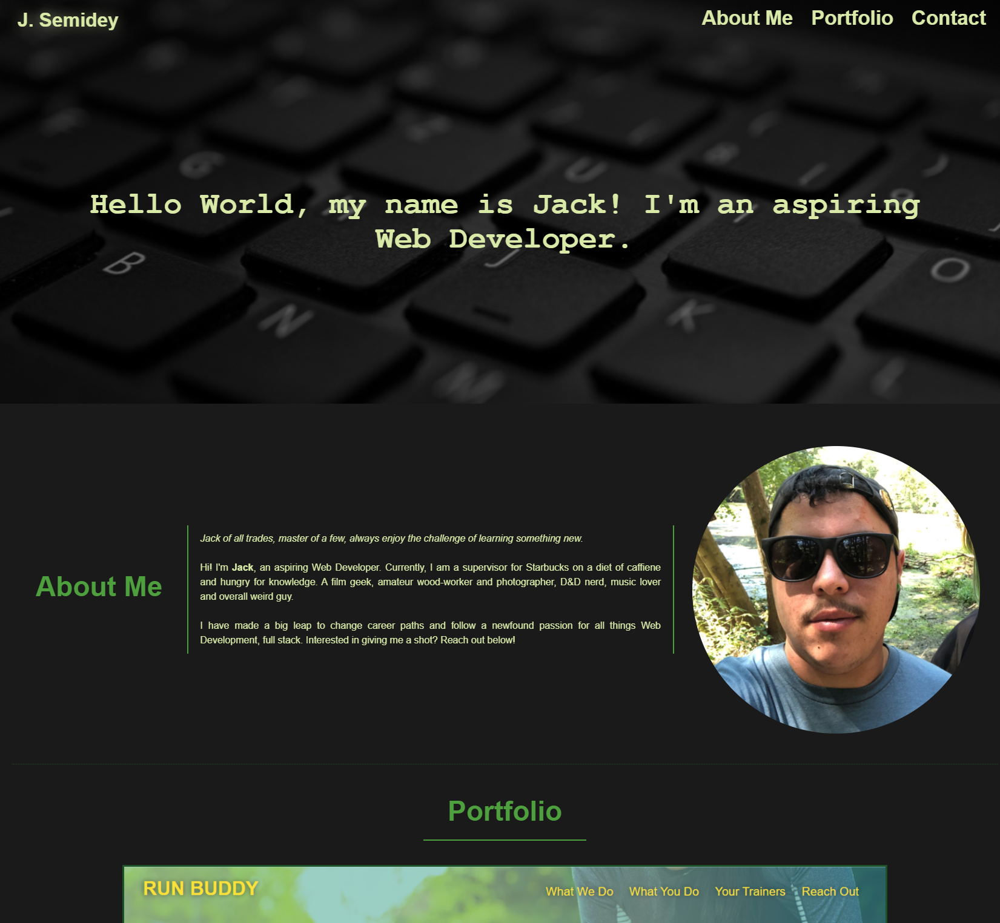

# Jack Semidey's Portfolio

## Online Professional Portfolio 

A  professional responsive online portfolio for live and upcoming projects with About Me and Contact sections, made using only HTML and advanced CSS techniques.
To be kept up to date as projects are added and become live.

# Features 

* Brief <em>About Me</em> section for a glimpse into who the developer is, with bar graph style proficiencies listed
* Project cards section that launchs projects externally (live projects only)
* Placeholder images set for upcoming projects
* Links to social media platforms (GitHub, LinkedIn, Discord) with appropriate icons

## Submission

Deployed: https://blindsweatyhansolo.github.io/JSPortfolio/

Github Repo: https://github.com/blindsweatyhansolo/JSPortfolio

Screenshot:
